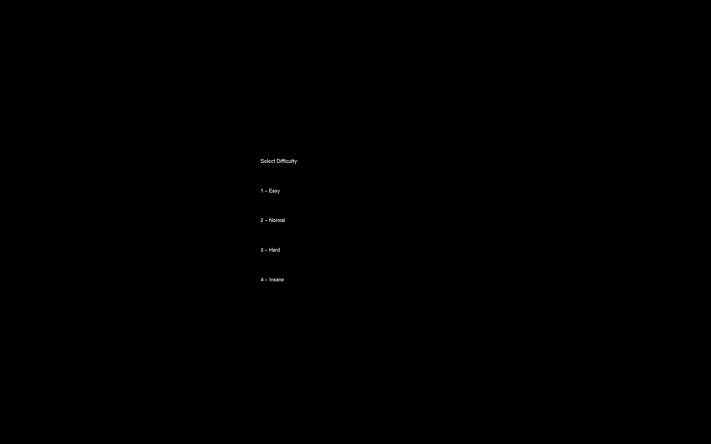
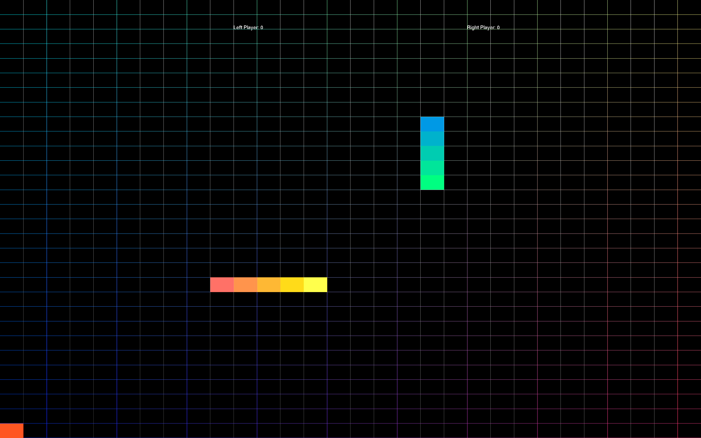

# Snake Battle 2D Game - OpenGL

A two-player snake game built with **OpenGL** and **GLUT**. Players compete to collect food and grow their snakes while avoiding collisions. The game features vibrant graphics, gradient effects, and a dynamic difficulty system.

## Features

- **Two-player mode**: Compete head-to-head.
- **Dynamic difficulty**: Choose from Easy to Insane levels.
- **Vibrant graphics**: Color gradients for snakes, grid, and pulsating food.
- **Game over scenarios**: Detects head-to-head and body collisions.
- **Wrap-around grid**: Snakes move through edges to the other side.
- **Scoreboard**: Real-time score updates for both players.

## How to Play

1. **Run the game**.
2. **Select difficulty** (1-4):
    - 1: Easy  
    - 2: Normal  
    - 3: Hard  
    - 4: Insane  
3. Control your snake:  
   - **Player 1** (Arrow keys):
     - ↑: Move up
     - ↓: Move down
     - →: Move right
     - ←: Move left  
   - **Player 2** (WASD keys):
     - W: Move up
     - S: Move down
     - D: Move right
     - A: Move left

4. Collect food to grow your snake and gain points.

5. Avoid collisions with the other player or yourself.

## Game Over Conditions

- **Head-to-head collision**: Game draws.
- **Snake collides with opponent's body**: Opponent wins.
- **Snake collides with itself**: Opponent wins.

## Requirements

- OpenGL  
- GLUT (FreeGLUT recommended for modern systems)  
- C++ compiler (e.g., g++)

## Installation and Execution

1. Clone the repository:
   ```bash
   git clone https://github.com/yadnyesh001/Snake-Game-using-OpenGL
   ```
2. Compile the code:
   ```bash
   g++ -o snake-game main.cpp -lGL -lGLU -lglut
   ```
3. Run the game:
   ```bash
   ./snake-game
   ```

## Screenshots

- Difficulty selection menu


- Vibrant grid with gradient snakes

- Real-time scoreboard

## Future Enhancements

- Add sound effects.
- Include more levels or a single-player mode.
- Implement power-ups and obstacles.
